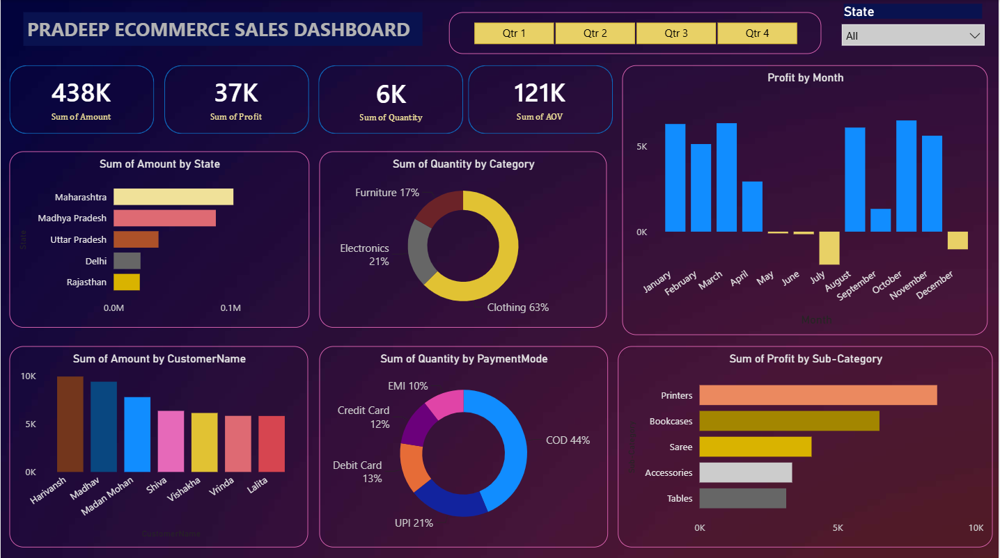

# 📊 Ecommerce Sales Dashboard (Power BI)

## Project Overview
This project presents an interactive Ecommerce Sales Dashboard developed using Microsoft Power BI.
The dashboard helps analyze overall business performance by tracking:
- Total Sales
- Total Profit
- Total Quantity Sold
- Average Order Value (AOV)
- Monthly Profit Trend
- Sales by State
- Sales by Customer
- Category-wise Sales
- Payment Mode Distribution
- Profit by Product Sub-Category
---
## Dashboard Preview
## 📊 Dashboard Preview
 
---
## Tools Used
- Microsoft Power BI
- Power Query
- DAX
- CSV Dataset
---
## Key Insights
- Clothing contributes the highest quantity sold.
- COD is the most preferred payment mode.
- Maharashtra generates the highest sales.
- Printers deliver the highest profit among sub-categories.
- Monthly profit varies across all quarters.
---
## Files Included
Dashboard/
- Ecommerce_Sales_Dashboard.pbix
Dataset/
- Orders.csv
- Details.csv
Images/
- dashboard-overview.png
---
## Skills Demonstrated
- Data Cleaning
- Data Modeling
- DAX Measures
- Interactive Dashboard Design
- KPI Reporting
- Business Intelligence
---
## Author
Pradeep Prasad Chaudhary

LinkedIn:
www.linkedin.com/in/pradeep-chaudhary-714555328
